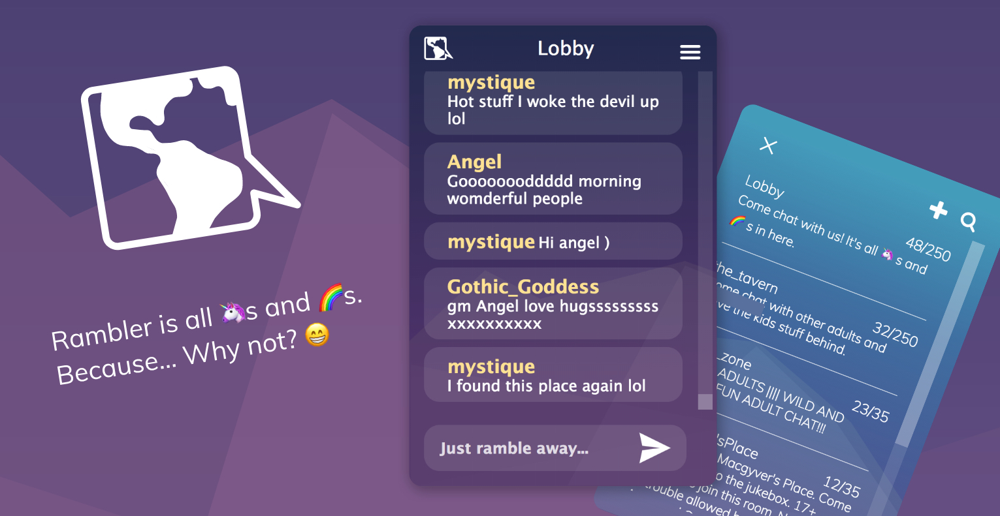

Rambler is a chat server and browser based chat (desktop and mobile) originally designed to power EveryWhereChat (EWC), a reasonably popular web chat that ran from 1998 to 2019. It was created by [Joshua Graham](https://joshuagraham.info) and [Kel Piffner](https://kellen.piffner.com) mostly because they wanted to play around with websockets and make something shiny.

<details open="open">
  <summary>Table of Contents</summary>
  <ol>
    <li><a href="#what-does-it-do">What Does It Do?</a></li>
    <li>
      <a href="#getting-started">Getting Started</a>
      <ul>
        <li><a href="#prerequisites">Prerequisites</a></li>
        <li><a href="#get-it-going">Get It Going</a></li>
      </ul>
    </li>
    <li><a href="#usage">Usage</a></li>
    <li><a href="#roadmap">Roadmap</a></li>
    <li><a href="#contributing">Contributing</a></li>
  </ol>
</details>

## What Does It Do?

This is a browser-based chat; think Slack. It's designed to allow people to meet in a digital space and share ideas and thoughts. Because it was originally intended to be public (more like a forum) vs private (like Slack), it includes a number of features to help moderate the chat. It's also distinctly missing some features like posting of photos/youtube links/etc.

- Desktop/Mobile interfaces
- Push notifications
- PWA compliant (Can be added to the desktop on phones)
- User registration
- Room/Channel registration
- Guest logins
- Room list
- Room topics
- Stored conversation (When you log in, you can catch up on what you missed)
- Registered user only rooms (No guests)
- Secret rooms (Not in list, must know the name)
- Keyed rooms (Must know the key/password to join)
- Room moderation (owners/moderators)
- Room bans
- Room warnings (with a built-in 3 strikes to ban policy)
- Server bans
- User ignore lists (You can ignore other users)
- Private messaging
- DNSBL checks for blacklisted IPs, proxies/etc

## Getting Started

The chat is powered by a C#/DotNet backend using WebApi and Entity Framework. It connects to a SQL database. We've always used Postgres with it, but it should work with any SQL Entity Framework Supports.

The Frontend is AngularJS (old Angular). There's not too much special there, except we are using Typescript with it to make things simplier.

### Prerequisites

- .Net 5 SDK

  ```
  https://dotnet.microsoft.com/download/dotnet/5.0
  ```

- SQL (We recommend Postgres)

  ```
  https://www.postgresql.org/download/
  ```

- Typescript

  ```
  npm install typescript@latest -g
  ```

- Gulp

  ```
  npm install gulp@latest -g
  ```

- npm
  ```
  npm install npm@latest -g
  ```

### Get It Going

#### Database Setup

1. Create a new database in Postgres.
2. Create a user with access to that database.

#### Build server and migrate database

1. Copy appsettings.json from example-configs/Rambler.Server to Rambler.Server.
2. Load Rambler.sln in [Visual Studio Community Edition](https://visualstudio.microsoft.com/downloads/).
3. Build menu > Build
4. Build menu > Transform All T4 Templates
5. Update appsettings.json
   - ConnectionStrings.DefaultConnection needs to point to your database
6. Open Package Manager Console
   - Run update-database
7. Build frontend
   - Open a terminal in Rambler.Client/web
   ```sh
   npm install
   gulp build
   ```
8. Run solution in Visual Studio
9. Browse to http://127.0.0.1:5000

## Usage

Quick overview version.... I know this is really not descriptive enough and I'm happy for someone to volunteer to document this more thoroughly. The reality is, this was designed to run on multiple platforms in a variety of configurations. This is, roughly and vaguely, what our production setup looked like in the real world. It managed to cope with several hundred users at a time (peaks near 1k... nothing too fantastically large, but big enough for most communities) on a pretty low spec machine (Linode Basic 1gb machine, 512mb probably would have been sufficient) with no real issues for a couple years.

- Setup nginx with reverse proxy. Example nginx configs in example-configs folder.
- Setup Let's Encrypt to provide SSL certs via nginx.
- Run Rambler.Server as executable (you'll probably want to wrap this up as a service of some sort)
- Host the client files either directly on nginx, on a completely separate resource (e.g. AWS S3) or directly via Rambler.Server

## Roadmap

- Port the Angular frontend to something less ancient. (I'm not sure porting to Angular/React/Vue would really be of great benefit. I'd consider going frameworkless possibly with WebComponents.)
- Unit tests... There are a few at the server level, but the entire project is completely lacking in unit tests.
- Embedded YouTube videos in the chat. There's code there. Pretty sure it works, but we commented it out as it was being abused. (Could easily be modified to support imgur/etc.)
- Swear filters are set at the server level. We always intended to extend support to allow rooms to manage this.
- Bans automaticlaly ban nicknames, IP addresses and any other identifiable info, but they're not 100% accurate.
- Server bans are all command driven via /sban, there should probably be some UI for this.

## Contributing

Contributions are what make the open source community such an amazing place to be learn, inspire, and create. Any contributions you make are **greatly appreciated**.

1. Fork the Project
2. Create your Feature Branch (`git checkout -b feature/AmazingFeature`)
3. Commit your Changes (`git commit -m 'Add some AmazingFeature'`)
4. Push to the Branch (`git push origin feature/AmazingFeature`)
5. Open a Pull Request

Project Link: [https://github.com/8labs/rambler](https://github.com/8labs/rambler)
